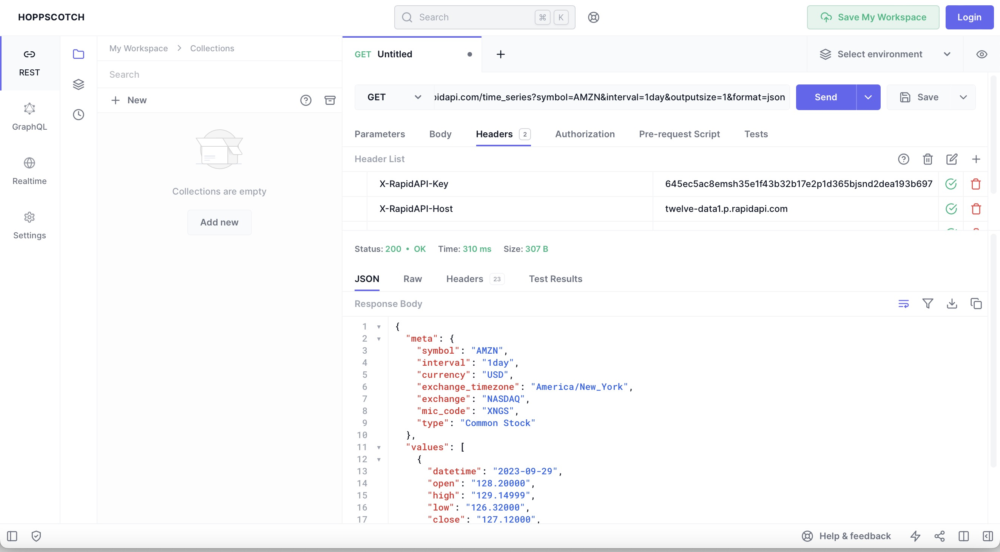
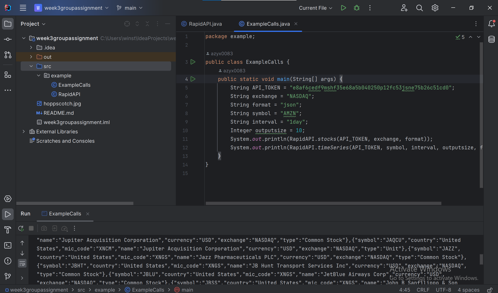

# week3groupassignment

### Problem Domain
We will be focusing on data analysis of US current and historical economic data (stock prices, S&P 500, US overall economic data)

### Description
We will aim to make correlations between data and extrapolation of new data using existing data. Specific data sets we will be using will (probably *may*) include US stock prices, the S&P 500, US overall economic data. We will allow the user to display raw and extrapolated data in at least one graphical form, a tabular form, and a computer-calculated line-of-best-fit equation form.

### API Documentation Links
https://twelvedata.com/docs

### API Fetch/Get Screenshots

### Calling with Java

### Technical Problems Encountered
Tentative
